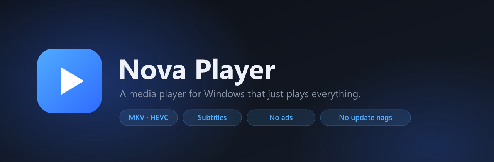

<p align="center">
  
</p>

<p align="center">
  
  
  
  
  
</p>

<h3 align="center">A desktop media player that plays everything, remembers where you left off,<br>and never interrupts you.</h3>

<p align="center">
  Inspired by the mobile players that got it right — built natively for Windows,<br>
  with a real control bar, real keyboard shortcuts, and a library that looks good.
</p>

---

## Download

**[⬇ Download the latest release](../../releases/latest)**

| | |
|---|---|
| **`Nova-Player-Setup-1.0.0.exe`** | Installer. Sets up Start-menu and desktop shortcuts, and registers Nova as an option for video files. Installs for your user only — **no administrator password needed**. |
| **`Nova-Player-1.0.0-portable.zip`** | No installation. Unzip anywhere (including a USB stick) and run `Nova Player.exe`. |

Requires 64-bit Windows 10 or 11.

### About the Windows warning

Nova Player isn't signed with a commercial code-signing certificate, so the first time you run the installer Windows will show:

> **Windows protected your PC** — Microsoft Defender SmartScreen prevented an unrecognised app from starting.

This is expected for any independently released app without a paid certificate. Click **More info → Run anyway** to continue. If you'd like to confirm the download arrived intact, `SHA256SUMS.txt` is attached to every release:

```powershell
Get-FileHash .\Nova-Player-Setup-1.0.0.exe
```

---

## What it does

**Plays everything.** MKV, MP4, AVI, HEVC/H.265, 10-bit video, VP9, multi-track audio, embedded subtitles, network and HLS streams. Hardware-accelerated, so 4K playback barely touches your CPU.

**Remembers everything.** Every video resumes exactly where you left it — including the audio track and subtitle you'd selected. A floating resume button sits in the corner of the library and picks up whatever you were last watching.

**Organises your videos.** Point it at your video folders and it builds a browsable library with generated thumbnails, folder grouping, "Continue watching", watch history, playlists and search.

**Stays out of the way.** No ads. No telemetry. No accounts. No auto-updater, and no pop-up ever asking you to update.

### In the player

A full control bar that auto-hides while you watch:

- Seekbar with hover time preview and chapter markers
- Play/pause, previous/next, ±10 second skips
- Volume slider with boost up to 200%
- **Speed** — presets from 0.25× to 3×, plus a fine slider
- **Audio** — switch tracks, correct audio sync
- **Subtitles** — pick tracks, load external `.srt`/`.ass` files, adjust sync, size and vertical position
- **Video** — zoom, aspect ratio, rotate, loop
- **Playlist** — jump to any file in the queue
- A–B repeat, screenshots, fullscreen

### Mouse and keyboard

| Input | Action |
|---|---|
| Click / Double-click | Play-pause / Fullscreen |
| Drag left–right | Seek, with a live preview |
| Drag up–down, **right** half | Volume |
| Drag up–down, **left** half | Brightness |
| Mouse wheel | Volume |
| Right-click | Quick menu |
| <kbd>Space</kbd> | Play / pause |
| <kbd>←</kbd> <kbd>→</kbd> | Seek 10 seconds |
| <kbd>Shift</kbd> + <kbd>←</kbd> <kbd>→</kbd> | Seek 60 seconds |
| <kbd>[</kbd> <kbd>]</kbd> | Playback speed &nbsp;·&nbsp; <kbd>Backspace</kbd> resets |
| <kbd>L</kbd> | A–B repeat |
| <kbd>J</kbd> / <kbd>#</kbd> | Cycle subtitle / audio track |
| <kbd>Z</kbd> <kbd>X</kbd> | Subtitle sync |
| <kbd>,</kbd> <kbd>.</kbd> | Frame step |
| <kbd>F</kbd> | Fullscreen &nbsp;·&nbsp; <kbd>S</kbd> screenshot &nbsp;·&nbsp; <kbd>M</kbd> mute |
| <kbd>Esc</kbd> | Leave fullscreen, then back to the library |

---

## How it's built

Nova Player is an [Electron](https://www.electronjs.org/) application wrapped around [**mpv**](https://mpv.io), which does the actual decoding and rendering.

mpv runs as a separate process with its video surface embedded into the window, and Nova talks to it over a JSON IPC pipe. Because that embedded surface passes mouse input straight through on Windows, the entire playback UI lives in a transparent overlay window layered above it — which is what makes the control bar, gestures and menus work.

```
src/main/       Electron main process — window, mpv control, library scanning, storage
src/renderer/   Library UI (index/app/styles) and playback overlay (player.*)
mpv-config/     Engine configuration and key bindings
scripts/        Engine download, icon and banner generation
```

### Building it yourself

Requires [Node.js](https://nodejs.org/) 20 or newer on 64-bit Windows.

```bash
npm install      # dependencies
npm run setup    # download the mpv engine into vendor/ (~115 MB, not committed)
npm run icon     # generate build/icon.ico
npm start        # run in development
npm run dist     # build the installer and portable zip into dist/
```

---

## Credits

Playback is powered by [**mpv**](https://mpv.io), which deserves the credit for the format support and playback quality. The bundled Windows build comes from [zhongfly/mpv-winbuild](https://github.com/zhongfly/mpv-winbuild).

Nova Player's own source is released under the [MIT licence](LICENSE). The bundled mpv binary is distributed under the GPL — see [THIRD-PARTY-NOTICES.md](THIRD-PARTY-NOTICES.md) for licences and where to obtain its source.

Nova Player is an independent project. It is not affiliated with, endorsed by, or derived from any other media player.
